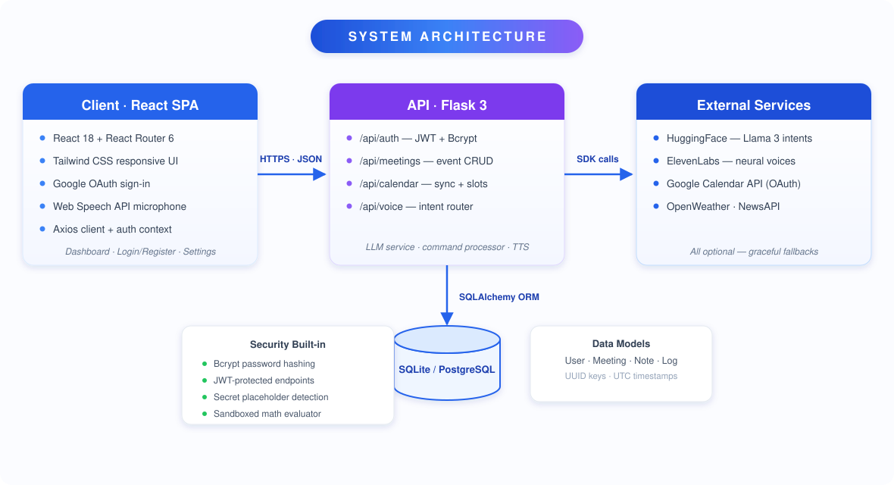
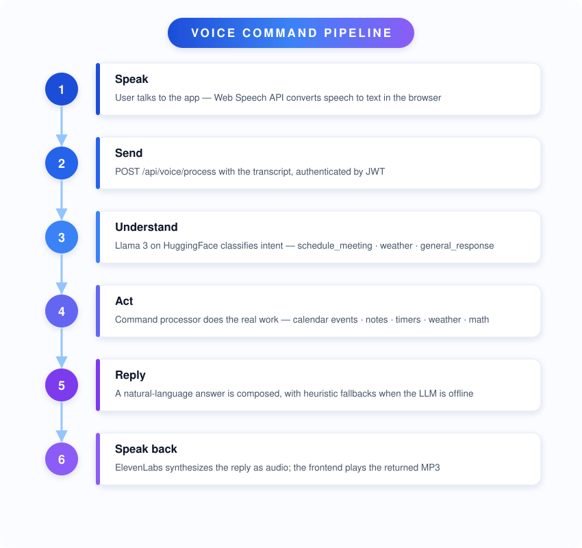
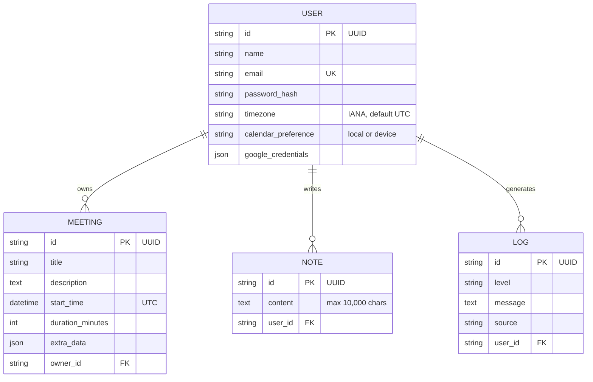

<div align="center">


# SmartMeet AI

**Speak. Schedule. Sync.**

An intelligent, voice-powered meeting assistant that pairs a modern React frontend
with a secure Flask API — dictate meeting requests in plain language, let AI do the rest.

[Features](#features) · [Architecture](#architecture) · [Voice Pipeline](#voice-pipeline) · [Tech Stack](#tech-stack) · [Quick Start](#quick-start) · [API Reference](#api-reference)


</div>

---

<a id="what-is-smartmeet-ai"></a>

## 🤔 What is SmartMeet AI?

SmartMeet AI turns *"Hey, schedule a sync with the design team tomorrow at 2pm for 45 minutes"*
into a real calendar event — no forms, no clicking.

> 🎤 **You speak** → 🧠 **AI understands** → 📅 **It's scheduled** → 🔊 **It confirms out loud**

Behind the scenes, a Hugging Face-hosted **Llama 3** model classifies your intent,
a command processor executes it against your calendar, notes, and tools, and
**ElevenLabs** speaks the confirmation back to you. Everything is wrapped in a
JWT-secured REST API with a clean Tailwind UI.

---

<a id="features"></a>

## ✨ Features

| | Feature | Description |
|---|---|---|
| 🎙️ | **Voice scheduling** | Dictate meetings naturally via the Web Speech API — no keyboard required |
| 🧠 | **LLM intent parsing** | Llama 3 classifies commands into structured actions; heuristic fallbacks keep it working offline |
| 📅 | **Meeting CRUD** | Create, list, and manage meetings backed by SQLAlchemy + migrations |
| 🔊 | **Spoken replies** | ElevenLabs neural TTS answers you out loud (gracefully degrades to text) |
| 🗓️ | **Google Calendar** | OAuth flow ready — create events and find free slots in your real calendar |
| 🛠️ | **15+ voice commands** | Weather, news, timers, reminders, notes, translation, jokes, math & more |
| 🔐 | **Secure by default** | JWT auth, Bcrypt hashing, secret-placeholder detection, sandboxed math evaluator |
| ♿ | **Accessible UI** | Semantic landmarks, aria labels, and visible keyboard focus states |
| 🌍 | **Timezone aware** | Per-user IANA timezones drive natural-language date parsing |

<details>
<summary><b>🗣️ All supported voice intents</b></summary>
<br>

| Category | Commands |
|---|---|
| Calendar | `schedule meeting` · `next meeting` · `today's events` · `upcoming events` · `find free time` · `calendar status` |
| Productivity | `take a note` · `set a reminder` · `set a timer` |
| Information | `weather in <city>` · `latest news` · `search for …` · `random fact` |
| Fun & utility | `tell me a joke` · `translate …` · `calculate 25 * 4` |

</details>

---

<a id="architecture"></a>

## 🏗️ Architecture

A classic two-tier split: a React SPA talks to a Flask REST API over JWT-authenticated JSON.
The backend orchestrates an LLM, TTS, and Google Calendar behind clean service boundaries.

<p align="center">
  
</p>

---

<a id="voice-pipeline"></a>

## 🎙️ How a voice command flows

From microphone to spoken confirmation in six steps:

<p align="center">
  
</p>

---

<a id="tech-stack"></a>

## 🧰 Tech Stack

<div align="center">

| Frontend | Backend | AI & Integrations | Data & Quality |
|:---:|:---:|:---:|:---:|
|  |  |  |  |
|  |  |  |  |
|  |  |  |  |

**React 18 · Tailwind CSS · React Router** — SPA, protected routes, Google OAuth
**Flask 3 · Python 3.11+ · JWT** — REST API, Bcrypt, CORS, migrations
**HuggingFace Llama 3 · ElevenLabs · Google Calendar** — intent, voice, scheduling
**SQLite / PostgreSQL · Pytest · Jest + RTL** — persistence & tests

</div>

---

<a id="project-structure"></a>

## 📂 Project Structure

```
smartmeet-ai/
├── backend/
│   ├── app/
│   │   ├── routes/            # auth · meetings · calendar · voice blueprints
│   │   ├── services/          # LLM, command processor, TTS, Google Calendar
│   │   ├── models.py          # User · Meeting · Note · Log
│   │   ├── extensions.py      # db, jwt, bcrypt, migrate singletons
│   │   └── timeutils.py       # fast ISO8601 parsing helpers
│   ├── migrations/            # Flask-Migrate (Alembic)
│   ├── tests/                 # Pytest suite
│   └── run.py                 # dev server entrypoint (:5000)
├── frontend/
│   ├── src/
│   │   ├── pages/             # Dashboard · Login · Register · Settings
│   │   ├── components/        # Layout · VoiceInput · ProtectedRoute
│   │   ├── context/           # AuthContext
│   │   ├── services/          # axios api client · voice service
│   │   └── __tests__/         # Jest + Testing Library suites
│   └── package.json
├── docs/
│   ├── architecture.md        # deeper architecture write-up
│   └── assets/                # README diagrams & icons
├── LICENSE
└── README.md
```

---

<a id="quick-start"></a>

## 🚀 Quick Start

### Prerequisites

| Tool | Version |
|---|---|
| Node.js | 18+ |
| Python | 3.11+ |
| PostgreSQL *(optional)* | 15+ — SQLite works out of the box |

### 1️⃣ Backend

```powershell
cd backend
python -m venv venv
venv\Scripts\activate
pip install -r requirements.txt
copy .env.example .env      # then edit .env (see table below)
flask db upgrade            # create/migrate the database
python run.py               # → http://localhost:5000
```

> ⚠️ Debug mode (Werkzeug reloader + debugger) is **off by default**. Enable it only
> for local development via `FLASK_DEBUG=true` in `.env` — never expose it publicly.

### 2️⃣ Frontend

```powershell
cd frontend
npm install                 # or: pnpm install
copy .env.example .env.local
npm start                   # → http://localhost:3000
```

---

<a id="environment-variables"></a>

## 🔑 Environment Variables

**Backend `.env`**

| Variable | Purpose | Required? |
|---|---|---|
| `SECRET_KEY` / `JWT_SECRET_KEY` | Session & token signing — generate with `python -c "import secrets; print(secrets.token_hex(32))"` | ✅ |
| `DATABASE_URL` | Defaults to SQLite (`sqlite:///smartmeet.db`) | ✅ |
| `HUGGINGFACE_API_KEY` | Llama 3 intent classification | optional |
| `GOOGLE_CLIENT_ID` / `GOOGLE_CLIENT_SECRET` / `GOOGLE_REDIRECT_URI` | Google Calendar OAuth | optional |
| `SENDGRID_API_KEY` | Email notifications | optional |
| `FRONTEND_URL` | CORS allow-list (default `http://localhost:3000`) | ✅ |

**Frontend `.env.local`**

| Variable | Purpose |
|---|---|
| `REACT_APP_API_URL` | Backend base URL (default `http://localhost:5000`) |
| `REACT_APP_GOOGLE_CLIENT_ID` | Google OAuth client id |

> 💡 The app starts fine without AI keys — voice replies fall back to text and the
> scheduler uses its built-in parser until credentials are provided.

---

<a id="data-model"></a>

## 🗄️ Data Model



---

<a id="api-reference"></a>

## 🌐 API Reference

Base URL: `http://localhost:5000` — all responses are JSON.

| Method | Endpoint | Description | Auth |
|:---:|---|---|:---:|
| `POST` | `/api/auth/register` | Create an account | — |
| `POST` | `/api/auth/login` | Sign in, returns a JWT | — |
| `POST` | `/api/auth/google` | Google OAuth sign-in | — |
| `GET` | `/api/auth/me` | Current user profile | 🔑 |
| `PATCH` | `/api/auth/me` | Update profile / timezone | 🔑 |
| `GET` | `/api/meetings` | List your meetings | 🔑 |
| `POST` | `/api/meetings` | Create a meeting | 🔑 |
| `PUT` | `/api/meetings/:id` | Update a meeting | 🔑 |
| `DELETE` | `/api/meetings/:id` | Delete a meeting | 🔑 |
| `POST` | `/api/calendar/sync` | Sync events from Google Calendar | 🔑 |
| `GET` | `/api/calendar/events` | List calendar events | 🔑 |
| `POST` | `/api/calendar/events` | Create event from ISO 8601 timestamps | 🔑 |
| `GET` | `/api/voice/greeting` | Spoken greeting (base64 TTS audio) | 🔑 |
| `POST` | `/api/voice/process` | Send a transcript → intent, reply & audio | 🔑 |

🔑 = requires the `Authorization: Bearer <token>` header

---

<a id="testing"></a>

## 🧪 Testing

```bash
# Backend — pytest
cd backend
pytest                          # full suite
pytest tests/test_command_logging.py -v   # one module

# Frontend — Jest + React Testing Library
cd frontend
npm test                        # watch mode
CI=true npm test                # single run (CI)
```

---

<a id="roadmap"></a>

## 🗺️ Roadmap

- [ ] Real OpenAI/LangChain parsing alongside the Llama 3 path
- [ ] Background Google Calendar sync jobs
- [ ] Notifications via SendGrid + Firebase Cloud Messaging
- [ ] Multi-tenant support and role-based access control
- [ ] Docker Compose for one-command local stacks

See [`docs/architecture.md`](docs/architecture.md) for flow details and deployment notes.

---

<a id="contributing"></a>

## 🤝 Contributing

1. Fork the repo and create a feature branch (`git checkout -b feature/amazing-idea`)
2. Make your changes and add/update tests
3. Run both test suites (see [Testing](#testing))
4. Open a Pull Request — small, focused PRs merge fastest

<a id="license"></a>

## 📄 License

Released under the [MIT License](LICENSE) — free to use, modify, and distribute.

---

<div align="center">

<br>
<b>SmartMeet AI</b> — meetings you can just talk to.
</div>
